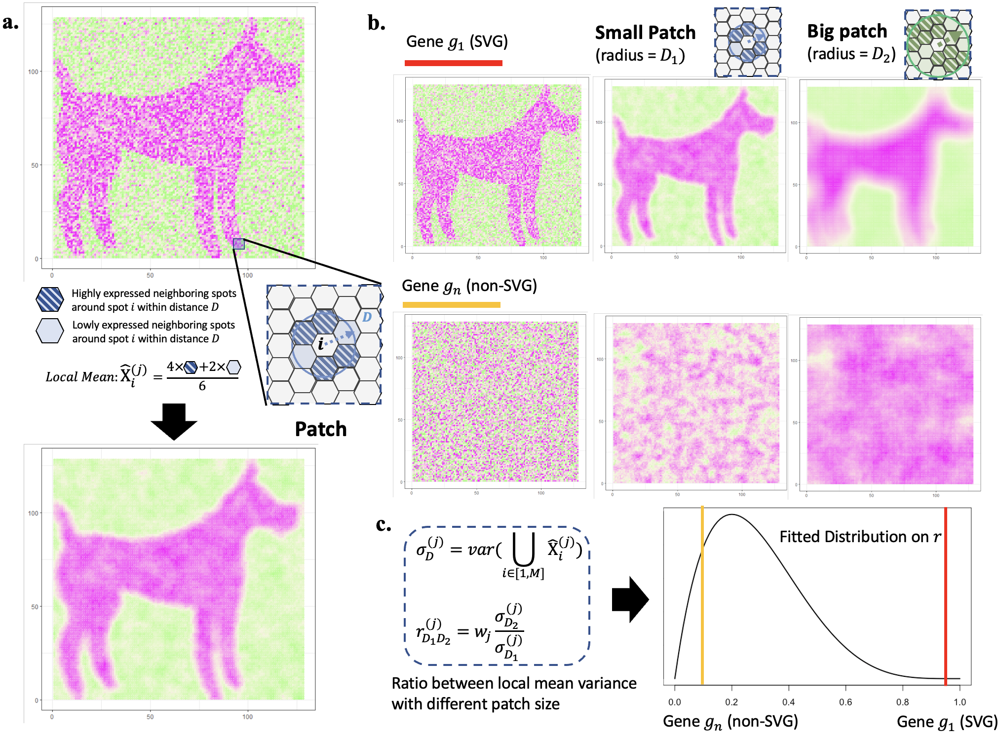

# Big-Small Patch (BSP)

[](https://zenodo.org/doi/10.5281/zenodo.10019315)

Big-small patch is a granularity-guided, data-driven, and parameter-free model for identifying spatial variable genes in 2D and 3D high-throughput spatial transcriptomics data.



### System Requirements
* Python 3.7+
* scikit-learn
* numpy
* pandas

### Installation
Tested on Windows 10, Ubuntu 16.04, CentOS 7, MacOS Monterey version 12.4, and MacOS M1 Pro Ventura 13.2.1.

### Quick Start

Place your spatial transcriptomic data as a folder under data/ folder. MOB (2D ST mouse olfactory from Stahl et al.) and 3Dsim are provided as the tutorial usage.

## Example 1: 2D spatial transcriptomics of ST mouse olfactor
```
python BSP.py --datasetName MOB --spaLocFilename Rep11_MOB_spa.csv --expFilename Rep11_MOB_count.csv
```

This step will load location and expression files individually under data/MOB/ folder, and generate MOB_P_values.csv in the project folder, where each row corresponds to each gene, each gene name with the inferred pvalue.

If use beta distribution:
```
python BSP.py --datasetName MOB --spaLocFilename Rep11_MOB_spa.csv --expFilename Rep11_MOB_count.csv --fitDist beta --adjustP
```

User can also output top-quantile genes regardless the p-values using argument ```--empirical```, and manually define quantiles by ```--quantiles```. 
```
python BSP.py --datasetName MOB --spaLocFilename Rep11_MOB_spa.csv --expFilename Rep11_MOB_count.csv --empirical --quantiles 0.05
```

## Example 2: 3D spatial transcriptomics from simulation
```
python BSP.py --inputDir data/3Dsim/  --for3DTag --useDirTag 
```
This step will load all location and expression combined files under data/3Dsim/ folder, and generate Pattern_1_P_values.csv in the project folder, where each row corresponds to each gene, each gene name with the inferred pvalue.

Both 2D and 3D examples should be finished in several seconds. On a MacOS M1 Pro Ventura 13.2.1, example 1 takes ~1 seconds, example 2 takes less than 1 seconds.

### Support data formats
1. Use Coordinates file and Expression file with single study (as example 1)
* Coordinates file: Row as spots, Column as x,y (for 2D), x,y,z (for 3D)
* Expression file: Row as spots, Column as genes

2. Input with single .csv file (as example 2)
* Rows as spots, Columns as 3D Coordinates ("x","y","z") or 2D Coordinates ("x","y")+ Genes

### Reproduction
The folder reproduction includes all the codes generating results in the manuscript.

### Data availability
All the data can be downloaded from the original publiations

### Cite
**Dimension-agnostic and granularity-based spatially variable gene identification using BSP.**
Wang, Juexin, Jinpu Li, Skyler T. Kramer, Li Su, Yuzhou Chang, Chunhui Xu, Michael T. Eadon, Krzysztof Kiryluk, Qin Ma, and Dong Xu. Nat Commun 14, 7367 (2023). https://doi.org/10.1038/s41467-023-43256-5


### Reference
1. Stahl, P. L. et al. Visualization and analysis of gene expression in tissue sections by spatial transcriptomics. Science 353, 78-82, 2016
2. https://github.com/mssanjavickovic/3dst

