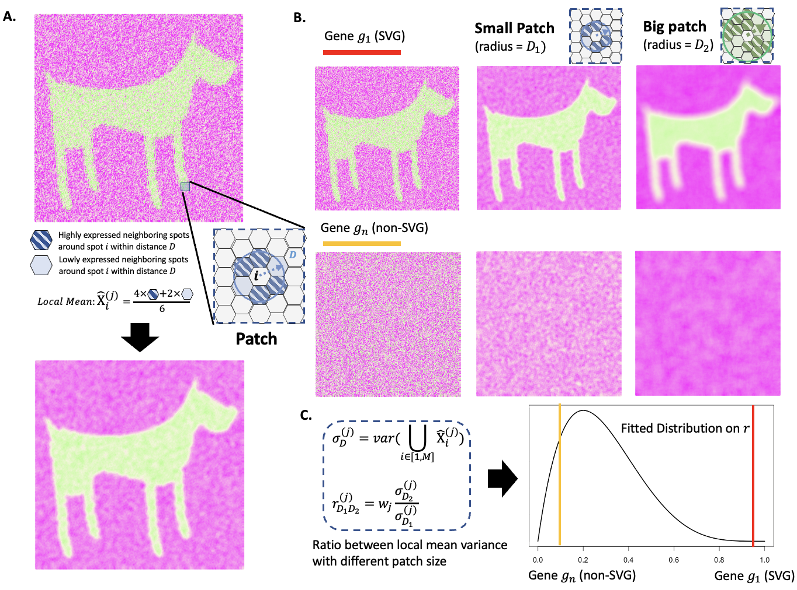

# Big-Small Patch (BSP)
## Update: scBSP is now available with better efficiency

[](https://zenodo.org/doi/10.5281/zenodo.10019315)

Big-small patch is a granularity-guided, data-driven, and parameter-free model for identifying spatial variable genes in 2D and 3D high-throughput spatial transcriptomics data.



## Update: Please use scBSP as a better implementation of BSP algorithm

Within the same algorithm of BSP, the newly released scBSP implementes sparse matrix operation and KD-tree/balltree method for distance calculation, for the identification of spatially variable genes on
large-scale data. Both Python and R implementations are provided. 

# Installation (R)
This package can be installed on R CRAN
```
# Install sparseMatrixStats if not already installed

if (!requireNamespace("BiocManager", quietly = TRUE)) {
    install.packages("BiocManager")
}

if (!requireNamespace("sparseMatrixStats", quietly = TRUE)) {
    BiocManager::install("sparseMatrixStats")
}

# Install scBSP from CRAN
install.packages("scBSP")

```

# Installation (Python)
This package can be installed using pip at [https://pypi.org/project/scbsp](https://pypi.org/project/scbsp/).
```
pip install scbsp
```

# Tutorial
A detailed tutorial is available at [here](https://castleli.github.io/scBSP/scBSP.html)

# Reference
Jinpu Li, Mauminah Raina, Yiqing Wang, Chunhui Xu, Li Su, Qi Guo, Ricardo Melo Ferreira, Michael T Eadon, Qin Ma, Juexin Wang, Dong Xu, scBSP: A fast and accurate tool for identifying spatially variable features from high-resolution spatial omics data, Bioinformatics, 2025;, btaf554, https://doi.org/10.1093/bioinformatics/btaf554.

Wang, Juexin, Jinpu Li, Skyler T. Kramer, Li Su, Yuzhou Chang, Chunhui Xu, Michael T. Eadon, Krzysztof Kiryluk, Qin Ma, and Dong Xu. "Dimension-agnostic and granularity-based spatially variable gene identification using BSP." Nature Communications 14, no. 1 (2023): 7367.

